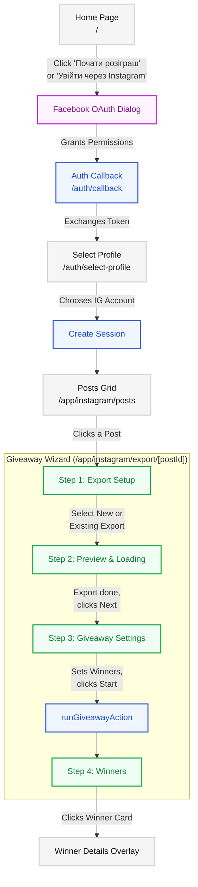

# User Interaction Path

Complete user journey from landing on the homepage to viewing giveaway winners.

## Flowchart

## Phase 1: Discovery & Authentication

### 1. Home Page (`/`)

- **State**: Unauthenticated
- **Components**: `Header`, `Hero`, `HowItWorks`, `Benefits`, `FuturePlans`, `FAQ`, `Footer`
- **Actions**:
  - Click "Почати розіграш" (hero CTA) — navigates to `/app/instagram/posts`
  - Click "Увійти через Instagram" (header login) — initiates Facebook OAuth

### 2. Facebook OAuth Dialog (external)

- User is redirected to Facebook
- User authorizes Pickly to access their Instagram Business/Creator account and comments

### 3. Auth Callback (`/auth/callback`)

- **Server-side route handler** (not a page)
- Validates CSRF state parameter (constant-time comparison)
- Exchanges authorization code for short-lived token, then 60-day long-lived token
- Fetches available Instagram Business accounts
- Stores temp profile data in Redis (5-minute TTL)
- Redirects to `/auth/select-profile?tempId=...&login_status=success&accounts_count=N`

### 4. Select Profile (`/auth/select-profile`)

- **UI**: Grid of profile cards with avatars, usernames, follower/post counts
- **Action**: User clicks "Вибрати цей профіль" on their desired account
- **Background**: `selectInstagramProfile` creates a 24-hour Redis session

## Phase 2: Post Selection

### 5. Posts Grid (`/app/instagram/posts`)

- **UI**: Profile header stats + Instagram-style 3-column grid with hover overlays (likes/comments)
- **Behavior**: Infinite scroll via IntersectionObserver (loads more 200px before trigger)
- **Action**: User clicks a post card, navigating to `/app/instagram/export/[postId]`

## Phase 3: Giveaway Wizard (`/app/instagram/export/[postId]`)

Distraction-free environment — no AppHeader, only wizard shell with bottom navigation.

### 6. Step 1: Export Setup

- **UI**: Dropdown selector
- **Options**: "Завантажити зараз" (download fresh comments) or select a previous export
- **Action**: Click "Далі" — creates new export job or loads existing one

### 7. Step 2: Preview & Loading

- **UI**: Progress bar during download, TanStack Table with loaded comments (username, text, date, likes)
- **Actions**:
  - Watch export progress (polling every 2.5s)
  - Scroll through paginated comment table
  - Download CSV via bottom nav button
  - Click "Далі" once export status is `done`

### 8. Step 3: Giveaway Settings

- **UI**: Context line ("Список від {date}, {count} учасників"), checkboxes, winner count slider/stepper
- **Settings**:
  - "Унікальні учасники" — count only first comment per user (default: on)
  - "Унікальні переможці" — each user can win only once (default: on)
  - Winner count: 1 to max participants
- **Action**: Click "Далі" — runs `runGiveawayAction` (ChaCha20 deterministic algorithm)

## Phase 4: The Reveal

### 9. Step 4: Winners Results

- **Animation**: 2.5-second roulette spinner, then confetti canvas
- **UI**: Staggered entrance of winner cards (gold 1st, silver 2nd, bronze 3rd)
- **Interaction**: Click a winner card to open details overlay

### 10. Winner Details Overlay

- **UI**: Spring-animated modal with winner avatar, username, full comment text, timestamp, like count
- **Action**: Click backdrop or close button to dismiss
- **Navigation**: "До публікацій" button returns to posts grid
